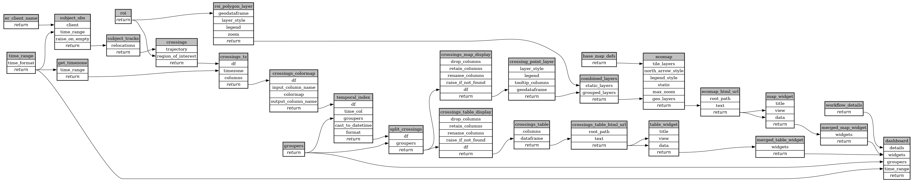

```
# AUTOGENERATED BY ECOSCOPE-WORKFLOWS; see fingerprint in README.md for details

```

```yaml
# fingerprint:
artifacts_sha256_basic: 90c1f79a1f31c6fb513684e257a6602082211354a97bd67e4428cdba7a730e46
artifacts_sha256_strict: 9d1088b29a63e8c47f900b25d36e5d014a50af88a0ecc7fb11302a898685f198
installed_requirements:
- channel: https://repo.prefix.dev/ecoscope-workflows/
  name: ecoscope-platform
  version: {version: ==2.13.0}
- channel: conda-forge
  name: pydeck
  version: {version: ==0.9.2}
params_sha256: 58d4ca93f6f3a606ce476c9af608cf61ec37460f0e18d125b6bc24c0a4eb1809
spec_sha256: 0873b601cea7ed97a00b60dc37f5f2e63138c74e6be4280acdfe425b3c0683f6

```

# ecoscope-workflows-geofence-crossing-workflow


